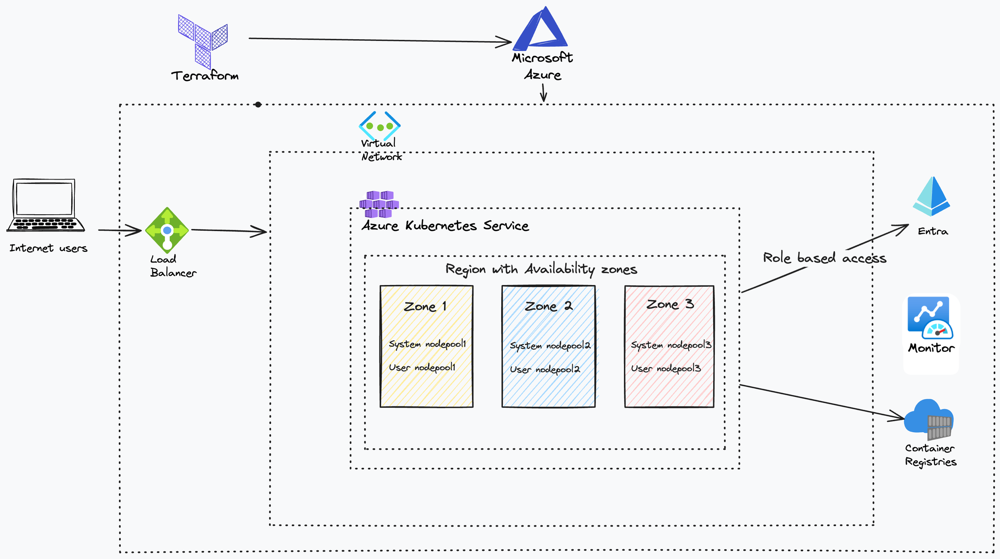

<!-- BEGIN_TF_DOCS -->
# terraform-azurerm-avm-ptn-aks-production

### NOTE: This module follows the semantic versioning and versions prior to 1.0.0 should be consider pre-release versions.

This is the Production Standard for AKS pattern module for [Azure Verified Modules (AVM)](https://azure.github.io/Azure-Verified-Modules/) library. This module deploys a production standard AKS cluster along with an Azure container registry. It is possible to provide an existing Log Analytics workspace or the module will create one for you. It provisions an environment sufficient for most production deployments for AKS. It leverages the AzureRM provider and sets a number of initial defaults to minimize the overall inputs for simple configurations. You can read more about our design choices in our [Tech Community Article](https://techcommunity.microsoft.com/t5/azure-for-isv-and-startups/how-to-deploy-a-production-ready-aks-cluster-with-terraform/ba-p/4122013).



Major version Zero (0.y.z) is for initial development. Anything MAY change at any time. A module SHOULD NOT be considered stable till at least it is major version one (1.0.0) or greater. Changes will always be via new versions being published and no changes will be made to existing published versions. For more details please go to <https://semver.org/>

## Deployment Steps

1. Set up a GitHub repo environment called `test`.
1. Configure environment protection rule to ensure that approval is required before deploying to this environment.
1. Create a user-assigned managed identity in your test subscription.
1. Create a role assignment for the managed identity on your test subscription, use the minimum required role.
1. Configure federated identity credentials on the user assigned managed identity. Use the GitHub environment.
1. Create the following environment secrets on the `test` environment:
   1. AZURE\_CLIENT\_ID
   1. AZURE\_TENANT\_ID
   1. AZURE\_SUBSCRIPTION\_ID
1. Search and update TODOs within the code and remove the TODO comments once complete.

<!-- markdownlint-disable MD033 -->
## Requirements

The following requirements are needed by this module:

- <a name="requirement_terraform"></a> [terraform](#requirement\_terraform) (>= 1.9, < 2.0)

- <a name="requirement_azapi"></a> [azapi](#requirement\_azapi) (>=2.0, < 3.0)

- <a name="requirement_azurerm"></a> [azurerm](#requirement\_azurerm) (>= 4, <5)

- <a name="requirement_modtm"></a> [modtm](#requirement\_modtm) (>= 0.3, < 1.0)

- <a name="requirement_null"></a> [null](#requirement\_null) (>= 3.0)

- <a name="requirement_random"></a> [random](#requirement\_random) (>= 3.5.0)

## Resources

The following resources are used by this module:

- [azapi_update_resource.aks_cluster_post_create](https://registry.terraform.io/providers/Azure/azapi/latest/docs/resources/update_resource) (resource)
- [azurerm_kubernetes_cluster.this](https://registry.terraform.io/providers/hashicorp/azurerm/latest/docs/resources/kubernetes_cluster) (resource)
- [azurerm_kubernetes_cluster_node_pool.this](https://registry.terraform.io/providers/hashicorp/azurerm/latest/docs/resources/kubernetes_cluster_node_pool) (resource)
- [azurerm_log_analytics_workspace.this](https://registry.terraform.io/providers/hashicorp/azurerm/latest/docs/resources/log_analytics_workspace) (resource)
- [azurerm_log_analytics_workspace_table.this](https://registry.terraform.io/providers/hashicorp/azurerm/latest/docs/resources/log_analytics_workspace_table) (resource)
- [azurerm_management_lock.this](https://registry.terraform.io/providers/hashicorp/azurerm/latest/docs/resources/management_lock) (resource)
- [azurerm_monitor_diagnostic_setting.aks](https://registry.terraform.io/providers/hashicorp/azurerm/latest/docs/resources/monitor_diagnostic_setting) (resource)
- [azurerm_role_assignment.acr](https://registry.terraform.io/providers/hashicorp/azurerm/latest/docs/resources/role_assignment) (resource)
- [azurerm_role_assignment.dns_zone_contributor](https://registry.terraform.io/providers/hashicorp/azurerm/latest/docs/resources/role_assignment) (resource)
- [azurerm_role_assignment.network_contributor_on_resource_group](https://registry.terraform.io/providers/hashicorp/azurerm/latest/docs/resources/role_assignment) (resource)
- [azurerm_user_assigned_identity.aks](https://registry.terraform.io/providers/hashicorp/azurerm/latest/docs/resources/user_assigned_identity) (resource)
- [modtm_telemetry.telemetry](https://registry.terraform.io/providers/Azure/modtm/latest/docs/resources/telemetry) (resource)
- [null_resource.kubernetes_version_keeper](https://registry.terraform.io/providers/hashicorp/null/latest/docs/resources/resource) (resource)
- [random_uuid.telemetry](https://registry.terraform.io/providers/hashicorp/random/latest/docs/resources/uuid) (resource)
- [azapi_resource_list.example](https://registry.terraform.io/providers/Azure/azapi/latest/docs/data-sources/resource_list) (data source)
- [azurerm_client_config.telemetry](https://registry.terraform.io/providers/hashicorp/azurerm/latest/docs/data-sources/client_config) (data source)
- [azurerm_subscription.current](https://registry.terraform.io/providers/hashicorp/azurerm/latest/docs/data-sources/subscription) (data source)
- [azurerm_user_assigned_identity.cluster_identity](https://registry.terraform.io/providers/hashicorp/azurerm/latest/docs/data-sources/user_assigned_identity) (data source)
- [modtm_module_source.telemetry](https://registry.terraform.io/providers/Azure/modtm/latest/docs/data-sources/module_source) (data source)

<!-- markdownlint-disable MD013 -->
## Required Inputs

The following input variables are required:

### <a name="input_location"></a> [location](#input\_location)

Description: The Azure region where the resources should be deployed.

Type: `string`

### <a name="input_name"></a> [name](#input\_name)

Description: The name for the AKS resources created in the specified Azure Resource Group. This variable overwrites the 'prefix' var (The 'prefix' var will still be applied to the dns\_prefix if it is set)

Type: `string`

### <a name="input_network"></a> [network](#input\_network)

Description: Values for the networking configuration of the AKS cluster

Type:

```hcl
object({
    node_subnet_id = string
    pod_cidr       = string
    service_cidr   = optional(string)
    dns_service_ip = optional(string)
  })
```

### <a name="input_resource_group_name"></a> [resource\_group\_name](#input\_resource\_group\_name)

Description: The resource group where the resources will be deployed.

Type: `string`

## Optional Inputs

The following input variables are optional (have default values):

### <a name="input_acr"></a> [acr](#input\_acr)

Description: (Optional) Parameters for the Azure Container Registry to use with the Kubernetes Cluster.

Type:

```hcl
object({
    name                          = string
    private_dns_zone_resource_ids = set(string)
    subnet_resource_id            = string
    zone_redundancy_enabled       = optional(bool)
  })
```

Default: `null`

### <a name="input_agents_tags"></a> [agents\_tags](#input\_agents\_tags)

Description: (Optional) A mapping of tags to assign to the Node Pool.

Type: `map(string)`

Default: `{}`

### <a name="input_default_node_pool_vm_sku"></a> [default\_node\_pool\_vm\_sku](#input\_default\_node\_pool\_vm\_sku)

Description: The VM SKU to use for the default node pool. A minimum of three nodes of 8 vCPUs or two nodes of at least 16 vCPUs is recommended. Do not use SKUs with less than 4 CPUs and 4Gb of memory.

Type: `string`

Default: `"Standard_D4d_v5"`

### <a name="input_enable_telemetry"></a> [enable\_telemetry](#input\_enable\_telemetry)

Description: This variable controls whether or not telemetry is enabled for the module.  
For more information see <https://aka.ms/avm/telemetryinfo>.  
If it is set to false, then no telemetry will be collected.

Type: `bool`

Default: `true`

### <a name="input_kubernetes_version"></a> [kubernetes\_version](#input\_kubernetes\_version)

Description: Specify which Kubernetes release to use. Specify only minor version, such as '1.28'.

Type: `string`

Default: `null`

### <a name="input_lock"></a> [lock](#input\_lock)

Description:   Controls the Resource Lock configuration for this resource. The following properties can be specified:

  - `kind` - (Required) The type of lock. Possible values are `\"CanNotDelete\"` and `\"ReadOnly\"`.
  - `name` - (Optional) The name of the lock. If not specified, a name will be generated based on the `kind` value. Changing this forces the creation of a new resource.

Type:

```hcl
object({
    kind = string
    name = optional(string, null)
  })
```

Default: `null`

### <a name="input_managed_identities"></a> [managed\_identities](#input\_managed\_identities)

Description:   Controls the Managed Identity configuration on this resource. The following properties can be specified:

  - `system_assigned` - (Optional) Specifies if the System Assigned Managed Identity should be enabled.
  - `user_assigned_resource_ids` - (Optional) Specifies a list of User Assigned Managed Identity resource IDs to be assigned to this resource.

Type:

```hcl
object({
    system_assigned            = optional(bool, false)
    user_assigned_resource_ids = optional(set(string), [])
  })
```

Default: `{}`

### <a name="input_monitor_metrics"></a> [monitor\_metrics](#input\_monitor\_metrics)

Description: (Optional) Specifies a Prometheus add-on profile for the Kubernetes Cluster  
object({  
  annotations\_allowed = "(Optional) Specifies a comma-separated list of Kubernetes annotation keys that will be used in the resource's labels metric."  
  labels\_allowed      = "(Optional) Specifies a Comma-separated list of additional Kubernetes label keys that will be used in the resource's labels metric."
})

Type:

```hcl
object({
    annotations_allowed = optional(string)
    labels_allowed      = optional(string)
  })
```

Default: `null`

### <a name="input_network_policy"></a> [network\_policy](#input\_network\_policy)

Description: (Optional) Sets up network policy to be used with Azure CNI. Network policy allows us to control the traffic flow between pods. Currently supported values are `calico` and `cilium`. Defaults to `cilium`.

Type: `string`

Default: `"cilium"`

### <a name="input_node_labels"></a> [node\_labels](#input\_node\_labels)

Description: (Optional) A map of Kubernetes labels which should be applied to nodes in this Node Pool.

Type: `map(string)`

Default: `{}`

### <a name="input_node_pools"></a> [node\_pools](#input\_node\_pools)

Description: A map of node pools that need to be created and attached on the Kubernetes cluster. The key of the map can be the name of the node pool, and the key must be static string. The value of the map is a `node_pool` block as defined below:  
map(object({  
  name                 = (Required) The name of the Node Pool which should be created within the Kubernetes Cluster. Changing this forces a new resource to be created. A Windows Node Pool cannot have a `name` longer than 6 characters. A random suffix of 4 characters is always added to the name to avoid clashes during recreates.  
  vm\_size              = (Required) The SKU which should be used for the Virtual Machines used in this Node Pool. Changing this forces a new resource to be created.  
  orchestrator\_version = (Required) The version of Kubernetes which should be used for this Node Pool. Changing this forces a new resource to be created.  
  max\_count            = (Optional) The maximum number of nodes which should exist within this Node Pool. Valid values are between `0` and `1000` and must be greater than or equal to `min_count`.  
  min\_count            = (Optional) The minimum number of nodes which should exist within this Node Pool. Valid values are between `0` and `1000` and must be less than or equal to `max_count`.  
  os\_sku               = (Optional) Specifies the OS SKU used by the agent pool. Possible values include: `Ubuntu`or `AzureLinux`. If not specified, the default is `AzureLinux`. Changing this forces a new resource to be created.  
  os\_disk\_type         = (Optional) Specifies the type of disk which should be used for the Operating System. Possible values include: `Managed`or `Ephemeral`. If not specified, the default is `Managed`. Changing this forces a new resource to be created.  
  mode                 = (Optional) Should this Node Pool be used for System or User resources? Possible values are `System` and `User`. Defaults to `User`.  
  os\_disk\_size\_gb      = (Optional) The Agent Operating System disk size in GB. Changing this forces a new resource to be created.  
  tags                 = (Optional) A mapping of tags to assign to the resource. At this time there's a bug in the AKS API where Tags for a Node Pool are not stored in the correct case - you [may wish to use Terraform's `ignore_changes` functionality to ignore changes to the casing](https://www.terraform.io/language/meta-arguments/lifecycle#ignore_changess) until this is fixed in the AKS API.  
  labels               = (Optional) A map of Kubernetes labels which should be applied to nodes in this Node Pool.
}))

Example input:
```terraform
  node_pools = {
    workload = {
      name                 = "workload"
      vm_size              = "Standard_D2d_v5"
      orchestrator_version = "1.28"
      max_count            = 110
      min_count            = 2
      os_sku               = "Ubuntu"
      mode                 = "User"
    },
    ingress = {
      name                 = "ingress"
      vm_size              = "Standard_D2d_v5"
      orchestrator_version = "1.28"
      max_count            = 4
      min_count            = 2
      os_sku               = "Ubuntu"
      os_disk_type         = "Ephemeral"
      mode                 = "User"
    }
  }
```

Type:

```hcl
map(object({
    name                 = string
    vm_size              = string
    orchestrator_version = string
    # do not add nodecount because we enforce the use of auto-scaling
    max_count       = optional(number)
    min_count       = optional(number)
    os_sku          = optional(string, "AzureLinux")
    os_disk_type    = optional(string, "Managed")
    mode            = optional(string)
    os_disk_size_gb = optional(number, null)
    tags            = optional(map(string), {})
    labels          = optional(map(string), {})
  }))
```

Default: `{}`

### <a name="input_orchestrator_version"></a> [orchestrator\_version](#input\_orchestrator\_version)

Description: Specify which Kubernetes release to use. Specify only minor version, such as '1.28'.

Type: `string`

Default: `null`

### <a name="input_os_disk_type"></a> [os\_disk\_type](#input\_os\_disk\_type)

Description: (Optional) Specifies the OS Disk Type used by the agent pool. Possible values include: `Managed` or `Ephemeral`. If not specified, the default is `Managed`.Changing this forces a new resource to be created.

Type: `string`

Default: `"Managed"`

### <a name="input_os_sku"></a> [os\_sku](#input\_os\_sku)

Description: (Optional) Specifies the OS SKU used by the agent pool. Possible values include: `Ubuntu` or `AzureLinux`. If not specified, the default is `AzureLinux`.Changing this forces a new resource to be created.

Type: `string`

Default: `"AzureLinux"`

### <a name="input_outbound_type"></a> [outbound\_type](#input\_outbound\_type)

Description: (Optional) Specifies the outbound type that will be used for cluster outbound (egress) routing. Possible values include: `loadBalancer`,`userDefinedRouting`,`managedNATGateway`,`userAssignedNATGateway`. If not specified, the default is `loadBalancer`.Changing this forces a new resource to be created.

Type: `string`

Default: `"loadBalancer"`

### <a name="input_private_dns_zone_id"></a> [private\_dns\_zone\_id](#input\_private\_dns\_zone\_id)

Description: (Optional) Either the ID of Private DNS Zone which should be delegated to this Cluster.

Type: `string`

Default: `null`

### <a name="input_private_dns_zone_id_enabled"></a> [private\_dns\_zone\_id\_enabled](#input\_private\_dns\_zone\_id\_enabled)

Description: (Optional) Enable private DNS zone integration for the AKS cluster.

Type: `bool`

Default: `false`

### <a name="input_rbac_aad_admin_group_object_ids"></a> [rbac\_aad\_admin\_group\_object\_ids](#input\_rbac\_aad\_admin\_group\_object\_ids)

Description: Object ID of groups with admin access.

Type: `list(string)`

Default: `null`

### <a name="input_rbac_aad_azure_rbac_enabled"></a> [rbac\_aad\_azure\_rbac\_enabled](#input\_rbac\_aad\_azure\_rbac\_enabled)

Description: (Optional) Is Role Based Access Control based on Azure AD enabled?

Type: `bool`

Default: `null`

### <a name="input_rbac_aad_tenant_id"></a> [rbac\_aad\_tenant\_id](#input\_rbac\_aad\_tenant\_id)

Description: (Optional) The Tenant ID used for Azure Active Directory Application. If this isn't specified the Tenant ID of the current Subscription is used.

Type: `string`

Default: `null`

### <a name="input_tags"></a> [tags](#input\_tags)

Description: (Optional) Tags of the resource.

Type: `map(string)`

Default: `null`

## Outputs

The following outputs are exported:

### <a name="output_current_kubernetes_version"></a> [current\_kubernetes\_version](#output\_current\_kubernetes\_version)

Description: The current version running on the Azure Kubernetes Managed Cluster

### <a name="output_fqdn"></a> [fqdn](#output\_fqdn)

Description: The FQDN of the Azure Kubernetes Managed Cluster

### <a name="output_http_application_routing_zone_name"></a> [http\_application\_routing\_zone\_name](#output\_http\_application\_routing\_zone\_name)

Description: The Zone Name of the HTTP Application Routing

### <a name="output_identity_principal_id"></a> [identity\_principal\_id](#output\_identity\_principal\_id)

Description: The Principal ID associated with this Managed Service Identity

### <a name="output_identity_tenant_id"></a> [identity\_tenant\_id](#output\_identity\_tenant\_id)

Description: The Tenant ID associated with this Managed Service Identity

### <a name="output_ingress_application_gateway_identity_client_id"></a> [ingress\_application\_gateway\_identity\_client\_id](#output\_ingress\_application\_gateway\_identity\_client\_id)

Description: The Client ID of the user-defined Managed Identity used by the Application Gateway

### <a name="output_ingress_application_gateway_identity_object_id"></a> [ingress\_application\_gateway\_identity\_object\_id](#output\_ingress\_application\_gateway\_identity\_object\_id)

Description: The Object ID of the user-defined Managed Identity used by the Application Gateway

### <a name="output_ingress_application_gateway_identity_user_assigned_identity_id"></a> [ingress\_application\_gateway\_identity\_user\_assigned\_identity\_id](#output\_ingress\_application\_gateway\_identity\_user\_assigned\_identity\_id)

Description: The ID of the User Assigned Identity used by the Application Gateway

### <a name="output_key_vault_secrets_provider_secret_identity_client_id"></a> [key\_vault\_secrets\_provider\_secret\_identity\_client\_id](#output\_key\_vault\_secrets\_provider\_secret\_identity\_client\_id)

Description: The Client ID of the user-defined Managed Identity used by the Secret Provider

### <a name="output_key_vault_secrets_provider_secret_identity_object_id"></a> [key\_vault\_secrets\_provider\_secret\_identity\_object\_id](#output\_key\_vault\_secrets\_provider\_secret\_identity\_object\_id)

Description: The Object ID of the user-defined Managed Identity used by the Secret Provider

### <a name="output_key_vault_secrets_provider_secret_identity_user_assigned_identity_id"></a> [key\_vault\_secrets\_provider\_secret\_identity\_user\_assigned\_identity\_id](#output\_key\_vault\_secrets\_provider\_secret\_identity\_user\_assigned\_identity\_id)

Description: The ID of the User Assigned Identity used by the Secret Provider

### <a name="output_kube_admin_config"></a> [kube\_admin\_config](#output\_kube\_admin\_config)

Description: The kube\_admin\_config block for the Azure Kubernetes Managed Cluster

### <a name="output_kube_admin_config_raw"></a> [kube\_admin\_config\_raw](#output\_kube\_admin\_config\_raw)

Description: Raw Kubernetes config for the admin account

### <a name="output_kube_config"></a> [kube\_config](#output\_kube\_config)

Description: The kube\_config block for the Azure Kubernetes Managed Cluster

### <a name="output_kube_config_raw"></a> [kube\_config\_raw](#output\_kube\_config\_raw)

Description: Raw Kubernetes config for the user account

### <a name="output_kubelet_identity_client_id"></a> [kubelet\_identity\_client\_id](#output\_kubelet\_identity\_client\_id)

Description: The Client ID of the user-defined Managed Identity assigned to the Kubelets

### <a name="output_kubelet_identity_object_id"></a> [kubelet\_identity\_object\_id](#output\_kubelet\_identity\_object\_id)

Description: The Object ID of the user-defined Managed Identity assigned to the Kubelets

### <a name="output_kubelet_identity_user_assigned_identity_id"></a> [kubelet\_identity\_user\_assigned\_identity\_id](#output\_kubelet\_identity\_user\_assigned\_identity\_id)

Description: The ID of the User Assigned Identity assigned to the Kubelets

### <a name="output_load_balancer_profile_effective_outbound_ips"></a> [load\_balancer\_profile\_effective\_outbound\_ips](#output\_load\_balancer\_profile\_effective\_outbound\_ips)

Description: The effective outbound IPs for the load balancer profile

### <a name="output_nat_gateway_profile_effective_outbound_ips"></a> [nat\_gateway\_profile\_effective\_outbound\_ips](#output\_nat\_gateway\_profile\_effective\_outbound\_ips)

Description: The effective outbound IPs for the NAT Gateway profile

### <a name="output_network_profile"></a> [network\_profile](#output\_network\_profile)

Description: The network profile block for the Kubernetes cluster

### <a name="output_node_resource_group"></a> [node\_resource\_group](#output\_node\_resource\_group)

Description: The auto-generated Resource Group containing resources for the Managed Kubernetes Cluster

### <a name="output_node_resource_group_id"></a> [node\_resource\_group\_id](#output\_node\_resource\_group\_id)

Description: The ID of the Resource Group containing resources for the Managed Kubernetes Cluster

### <a name="output_oidc_issuer_url"></a> [oidc\_issuer\_url](#output\_oidc\_issuer\_url)

Description: The OIDC issuer URL that is associated with the cluster

### <a name="output_oms_agent_identity_client_id"></a> [oms\_agent\_identity\_client\_id](#output\_oms\_agent\_identity\_client\_id)

Description: The Client ID of the user-defined Managed Identity used by the OMS Agents

### <a name="output_oms_agent_identity_object_id"></a> [oms\_agent\_identity\_object\_id](#output\_oms\_agent\_identity\_object\_id)

Description: The Object ID of the user-defined Managed Identity used by the OMS Agents

### <a name="output_oms_agent_identity_user_assigned_identity_id"></a> [oms\_agent\_identity\_user\_assigned\_identity\_id](#output\_oms\_agent\_identity\_user\_assigned\_identity\_id)

Description: The ID of the User Assigned Identity used by the OMS Agents

### <a name="output_portal_fqdn"></a> [portal\_fqdn](#output\_portal\_fqdn)

Description: The FQDN for the Azure Portal resources when private link has been enabled

### <a name="output_private_fqdn"></a> [private\_fqdn](#output\_private\_fqdn)

Description: The FQDN for the Kubernetes Cluster when private link has been enabled

### <a name="output_resource_id"></a> [resource\_id](#output\_resource\_id)

Description: The Kubernetes Managed Cluster ID.

### <a name="output_web_app_routing_web_app_routing_identity_client_id"></a> [web\_app\_routing\_web\_app\_routing\_identity\_client\_id](#output\_web\_app\_routing\_web\_app\_routing\_identity\_client\_id)

Description: The Client ID of the user-defined Managed Identity used for Web App Routing

### <a name="output_web_app_routing_web_app_routing_identity_object_id"></a> [web\_app\_routing\_web\_app\_routing\_identity\_object\_id](#output\_web\_app\_routing\_web\_app\_routing\_identity\_object\_id)

Description: The Object ID of the user-defined Managed Identity used for Web App Routing

### <a name="output_web_app_routing_web_app_routing_identity_user_assigned_identity_id"></a> [web\_app\_routing\_web\_app\_routing\_identity\_user\_assigned\_identity\_id](#output\_web\_app\_routing\_web\_app\_routing\_identity\_user\_assigned\_identity\_id)

Description: The ID of the User Assigned Identity used for Web App Routing

## Modules

The following Modules are called:

### <a name="module_avm_res_containerregistry_registry"></a> [avm\_res\_containerregistry\_registry](#module\_avm\_res\_containerregistry\_registry)

Source: Azure/avm-res-containerregistry-registry/azurerm

Version: 0.4.0

<!-- markdownlint-disable-next-line MD041 -->
## Data Collection

The software may collect information about you and your use of the software and send it to Microsoft. Microsoft may use this information to provide services and improve our products and services. You may turn off the telemetry as described in the repository. There are also some features in the software that may enable you and Microsoft to collect data from users of your applications. If you use these features, you must comply with applicable law, including providing appropriate notices to users of your applications together with a copy of Microsoft’s privacy statement. Our privacy statement is located at <https://go.microsoft.com/fwlink/?LinkID=824704>. You can learn more about data collection and use in the help documentation and our privacy statement. Your use of the software operates as your consent to these practices.
<!-- END_TF_DOCS -->